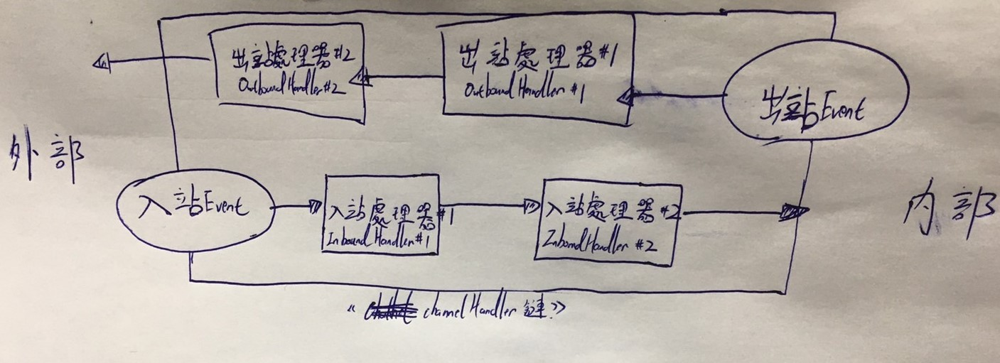
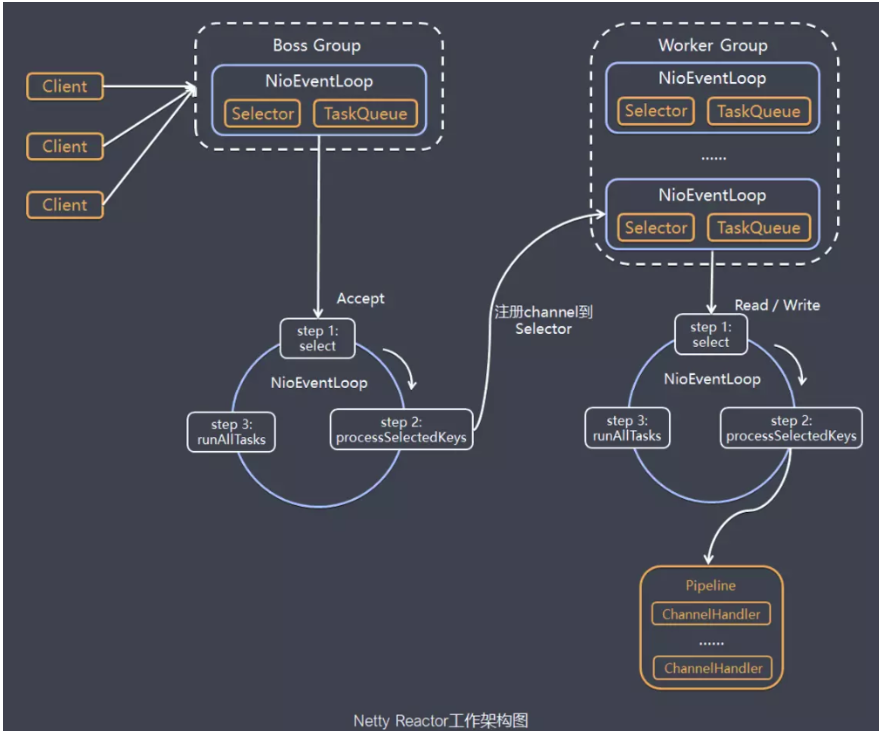
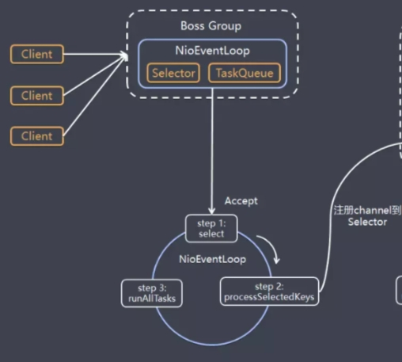
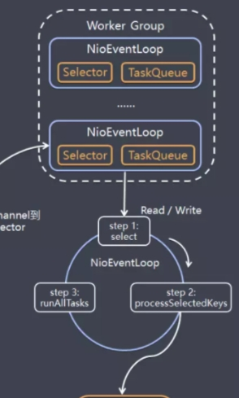
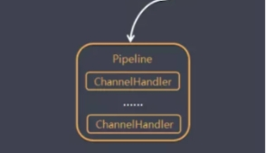
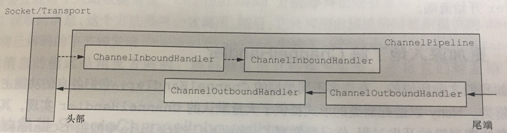

# 關於 Netty

<br>

---

<br>

雖然在筆記開頭部分提到不會過度強調 Netty 的知識細節，但是還是嘗試蓋括性的解釋一下 `Netty` 的設計結構以及在這個應用中我們如何在 Netty 框架的基礎上建構出完整的應用。

<br>

事實上，整個應用幾乎就是完全依賴於 Netty 框架，所以要解釋整個應用的設計一定是離不開Netty 框架。

<br>

接下來就按照設計結構到實作順序來介紹。

<br>
<br>
<br>
<br>

## 目錄

<br>

* [Netty 的核心成員](#1)

* [Netty 應用架構](#2)

<br>
<br>
<br>
<br>

<div id='1'>

## Netty 的核心成員

<br>

把 Netty 框架比做成一間公司好了，裡面當然就必須有核心成員們各司其職來讓整間能夠有效率的運作。在這個部分，我們來著重介紹一下在 Netty 這家 "公司" 上班的各位員工。

<br>

* ### `Channel`

  Channel 是 Java NIO 的一個基本構造。__他代表一個到實體的開放連接通道，可以執行讀寫操作。__

  可以把 Channel 看作是 __傳出__ 或 __傳入__ 資料的管道（真正意義上的管道/通道），因此它可以被打開或關閉，連接或者斷開。

<br>
<br>

* ### `回調`

  Netty 中大量使用了回調方法，如果你知道 __Linstener 設計模式__ 會比較能理解回調具體是怎麼一回事。他就像我們預先設定好一個方法，當某些條件達成時，便會使用這些方法邏輯，回調在 coding 的應用上被廣泛使用，通常是在操作完成後通知相關方最常見的方法，就非常像 Linstner。

  Netty 在內部設計上使用回調處裡事件，當一個事件被觸發，相關事件可以被 `ChannelHandler` interface  的實現類處裡。
  
  例如當一個 Client 連線進來，`ChannelHandler` 的 `channelActive()` 回調方法就會被調用：


  ```java
  public class ServerObjectHandler extends ChannelInboundHandlerAdapter {

      @Override
      public void channelActive(ChannelHandlerContext ctx) {
        System.out.println("connected with : " + ctx.channel().remoteAddress());
    }
  }
  ```

<br>
<br>

* ### `Future`

  Future 提供了與回調不同的，在操作完成時通知應用程式的方法。就如同它的名字一樣 `Future`，它就是一個代表未來的物件。比較正式一點的說法是 : __Future是代表一個非同步呼叫的回傳結果。__ 它將在未來某時刻把工作處裡完成，並可以讓我們對其結果進行訪問。

  舉一個生活例子就是 __微波爐__，我們把食物丟給微波爐並按下加熱 3 分鐘，這時微波爐就是一個 Future 物件，它將在未來某時刻完成這個加熱工作，並提供我們取出加熱完成的食物的方法。

  <br>

  Java 設計團隊在 JDK 中置入了 interface : `java.util.concurrent.Future`，但是官方所提供實現只允許手動檢查工作是否完成（想像一下加熱完沒有 '叮' 聲音的微波爐，我們只能自己打開檢查是否加熱完成），所以 Netty 寫了一個 interface : `ChannelFuture` 繼承 JDK 的 `Future` 解決這個問題：

  ```java
  package io.netty.util.concurrent;

  // 1 先寫一個 interface:Future 繼承 java.util.concurrent.Future
  public interface Future<V> extends java.util.concurrent.Future<V> {
      ...
      Future<V> addListener(GenericFutureListener<? extends Future<? super V>> var1);
      ...
  }
  ```

  ```java
  package io.netty.channel;

  // 2 再寫 interface:ChannelFuture 繼承 Future
  public interface ChannelFuture extends Future<Void> {
      ...
      ChannelFuture addListener(GenericFutureListener<? extends Future<? super Void>> var1);
      ...
  }
  ```

  <br>


  `ChannelFuture` 提供了幾種額外方法，可以上我們註冊多個 `ChannelFutureListener` 物件。監聽回調方法 `operationComplete()` 將再操作完成時被調用。Listener 可以判斷操作成功完成還是失敗，如果失敗我們可以查看 `Throwable`。簡單來說就是由於加入了 Listener 設計模式（幫微波爐裝上提示鈴聲了），消除我們必須手動檢查這項操作。

  <br>

  每一個 __輸出 IO 操作__ 都會返回一個 `ChannelFuture` 物件，也就是說輸出動作並不會阻塞 Thread。

  <br>

  以下簡單介紹一個使用範例，針對成功連接遠端後的回調操作：

  <br>

  ```java
  Channel channel = ...;
  ChannelFuture future = channel.connect(new InetSocketAddress("localhost", 25))
  future.addListener(new ChannelFutureListener() {
      @Override
      public void operationComplete(ChannelFuture future){
          if (future.isSuccess()){
              // 成功：做連線成功後的操作
          }else{
              // 失敗：做連線失敗後的操作
              Throwable cause = future.cause();
              cause.printStackTrace();
          }
      }
  })
  ```


<br>
<br>

* ### `Event 與 ChannelHandler` 

  <br>

  Netty 使用不同的事件來通知我們狀態的改變，或操作的狀態。這樣我們可以基於以發生的事件觸發適當動作，這些動作可能是：

  * 記錄日誌

  * 資料轉換

  * Stream 控制

  * 應用邏輯

  <br>
  <br>

  Netty 的事件主要圍繞 __入站__ 與 __出站__ 這兩個動作的相關性進行分類。

  <br>

  由 __入站__ 而觸發的事件包括：

  * Remote 請求連接成功或失敗

  * 接收並讀取資料

  * 用戶事件

  * 錯誤事件

  <br>

  由 __出站__ 而觸發的事件包括：

  * 打開或關閉到 Remote 的連接

  * 將資料 writeAndFlash 到 socket

  <br>

  每個事件都可以被分發給 `ChannelHandler` 類中的某個我們實現的方法。

  <br>

  下面話一張圖來說明流經 ChannelHandler 鍊的入站出站事件：

  <br>

  

  <br>

  Netty 幫我們實現了很多豐富的 `ChannelHandler` 實現，比如像是支援各種協議 HTTP, SSL/TLS, Protobuf 之類的 `ChannelHandler` 實現。我們也可以自己寫自己的 `ChannelHandler` 實現加入到鍊中。

<br>
<br>
<br>
<br>

<div id='2'>

## Netty 應用架構

<br>

Netty 是非同步網路通訊框架，所以在繼續往下探索之前，需要對 Java NIO 有一定了解（`Selector`, `ThreadPool` 等）。

接下來先用一張圖蘭概括 Netty 的整體架構：

<br>



圖片來源: https://www.gushiciku.cn/pl/gCGE/zh-tw

<br>

這邊切成 3 塊來理解

* Boss Group

* Worker Group

* Channel Pipeline

<br>
<br>

### Boss Group

<br>



<br>

Boss Group 是一個 Thread Pool, 它其實就是由一個或一個以上的 `NioEventLoop` 組成。Boss Group 就像是主管階級，這一個 group 中的人專門負責接收上門來的 Client 連線，這些主管人員（EventLoop）會做 3 件事：

  * 處裡 Accept 事件，與 Client 連線，產生出 `NioSocketChannel` 物件。

  * 將 `NioSocketChannel` 註冊到 Worker Group （工作人員群組）中的某個 EventLoop （工人）的 `Selector` 上。

  * 處理任務佇列的任務，`runAllTask()`。

  <br>
  <br>

### Worker Group

<br>



<br>

Worker Group 也是一個 Thread Pool, 它同樣也是像 Boss Group 一樣由一個或一個以上 `NioEventLoop` (工作者) 組成。Worker 就像是工人階級，這一個 group 的人專門輪詢自己的工作崗位 `Selector`，Boss 隨時會分發 `NioSocketChannel` 來交給他們處裡。

每個在 Worker Group 工作的 EventLoop（工作人員）都會 3 件事：

* 輪詢註冊到自己 `Selector` 上的 `NioSocketChannel` 的 Read/Write 事件。

* 處裡這些 IO 事件（Read/Write），在對應的 `NioSocketChannel` 處裡業務邏輯。

* `runAllTasks()` 處理任務佇列 TaskQueue 的任務，一些耗時的業務處理一般可以放入 TaskQueue 中慢慢處理，這樣不影響資料在 Pipeline 中的流動處理。


<br>
<br>

### Channel Pipeline

<br>



<br>

Worker Group 的 Worker 們在處裡 `NioSocketChannel` 時就是透過 Channel Pipeline 完成，Pipeline 中就會有許多種之前提到的 `ChannelHandler`。

<br>



<br>
<br>
<br>
<br>

---

<br>

更多 Netty 的技術知識這邊就不再繼續深挖了，不但寫不完而且會跑題。


