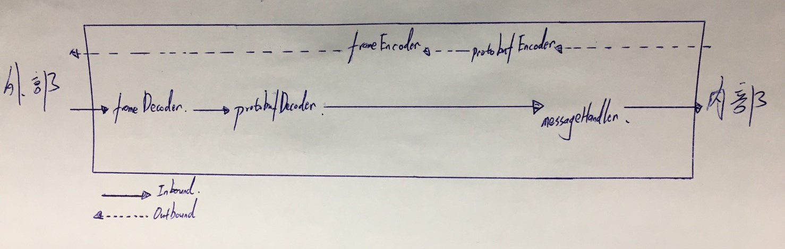

# Source Code 解析

<br>

---

<br>

接下來開始正式介紹套件的細節了，得益於使用 Netty，編寫一個基於 protobuf 協議的網路應用非常容易，並且代碼會非常簡潔（比起使用原生 API）。但是還是有很多需要注意的點需要注意。

<br>

下面正式開始。

<br>
<br>
<br>
<br>

## 大綱

<br>

* [proto ( 資料容器 )](#1)

* [booter ( 啟動器類 )](#2)

* [handler ( Netty 的 ChannelHandler 類）](#3)

* [processor (處理 IO read 邏輯)](#4)

* [listener (自製監聽器類)](#5)

<br>
<br>
<br>
<br>

<div id='1'>

## proto ( 資料容器 )

<br>

正式的 .proto 檔案經過工具編譯後產生的 .java 檔，單獨放置在這一層中。內部實現細節不必知道，對於這一塊功能我們只需要專注於如何使用 Google Protobuf 官方給的 API 文件就好。

<br>

下面簡單介紹一下這個專案使用到的 protobuf 資料格式以及如何新增跟讀取。

<br>

`ProtoData.java` 建立：

```java
//------------ 建立 node record 與 stop record -------------//
ProtoData.PbData name = ProtoData.PbData.newBuilder()
        .setDataType(ProtoData.PbData.DataType.STRING)
        .setBinaryData(ByteString.copyFrom("Johnny".getBytes()))
        .build();

ProtoData.PbData age = ProtoData.PbData.newBuilder()
        .setDataType(ProtoData.PbData.DataType.INT)
        .setBinaryData(ByteString.copyFrom(ByteBuffer.allocate(4).putInt(23).array()))
        .build();

ProtoData.Record nodeRecord = ProtoData.Record.newBuilder()
        .setSignal(ProtoData.Record.Signal.NODE)
        .putColumn("name", name)
        .putColumn("age", age)
        .build();

ProtoData.Record stopRecord = ProtoData.Record.newBuilder()
        .setSignal(ProtoData.Record.Signal.STOP)
        .build();
```

<br>

`ProtoData.java` 讀取：

```java
//------------ 讀取 node record 與 stop record -------------//
System.out.println("nodeRecord Signal: " + nodeRecord.getSignal());
ProtoData.PbData data1 = nodeRecord.getColumnOrThrow("name");
ProtoData.PbData data2 = nodeRecord.getColumnOrThrow("age");
System.out.println("nodeRecord Column1<name> dataType: " + data1.getDataType());
System.out.println("nodeRecord Column1<name> binaryData: " + data1.getBinaryData());
System.out.println("nodeRecord Column1<age> dataType: " + data2.getDataType());
System.out.println("nodeRecord Column1<age> binaryData: " + data2.getBinaryData());
System.out.println("---------------------------------------------");
System.out.println(stopRecord);
```


<br>
<br>
<br>
<br>

<div id='2'>

## booter ( 啟動器類 )

<br>

booter 這一層中有一個介面：`ApplicationBooter`，它定義了這個應用的所有必須具備的功能，具體需要實現的功能如下：

<br>

```java
public interface ApplicationBooter<T> {
    // App 啟動方法
    void startUp();

    @Deprecated
    void waitForConnection();

    @Deprecated
    void sendData(T t);

    @Deprecated
    void processEnd();
    
    // 強制中止工作
    void forceStopJob();
    
    // 加入在工作結束階段接收通知處理的 Listener
    void addProcessEndListener(ProcessEndListener listener);
    // 移除在工作結束階段接收通知處理的 Listener
    void removeProcessEndListener(ProcessEndListener listener);

    // 加入在連線成功階段接收通知處理的 Listener
    void addChannelActiveListener(ChannelActiveListener listener);
    
    // 移除在連線成功階段接收通知處理的 Listener
    void removeChannelActiveListener(ChannelActiveListener listener);
    
    // 檢查目前是否有 CLIENT 連線
    boolean isConnected();

}
```

其中 `waitForConnection()`, `sendData()`, `processEnd()` 是上一個版本的遺留物，在這一個版本的應用中已經廢棄舊有的方法了，這邊只需要注意沒有標住 `@Deprecated` 的方法。

其餘的方法說明我都寫在方法註解上了，下面就不再做多餘說明了。

<br>

定義好了介面方法之後就該要實作了，在這一層中也同時定義了一個抽象類別 `AbstractApplicationBooter` 繼承 `ApplicationBooter` 介面。關於這個類別需要著重介紹，基本上所有此專案細節都是根據這個類別延伸出去的。

<br>
<br>

### 建構函式與常量：

<br>

```java
private ServerObjectHandler serverObjectHandler;

private EventLoopGroup bossGroup;

//private EventLoopGroup workerGroup;

public AbstractApplicationBooter(RecordReader recordReader){
    this.serverObjectHandler = new ServerObjectHandler(recordReader);
    this.bossGroup = new NioEventLoopGroup(1); // 只分配一個 Thread
    //this.workerGroup = new NioEventLoopGroup(1);
}
```

<br>

這邊建構式需要傳入一個 `RecordReader` 介面的實現，這個 Reader 介面後面會做解釋，它主要的作用是用來定義如何處理 Socket 讀取的資料邏輯。

接下來可以看到雖然有 2 個 `EventLoopGroup` 但是其中一個被我註解起來了，看過前面的 __關於 Netty__ 章節說明，應該能夠了解到正常情況下要建立 Server 應用需要用到 __2 組 Group__。但是在這個應用上設計上基本只會允許一次連線，資料傳入 client 後經由處理再傳回此應用就結束生命週期，所以使用一個 Thread 就足以應對需求，多開只會間接浪費資源而已。這邊只保留一個 `bossGroup`，且只分配一個 Thread。

<br>
<br>

### 核心方法 `startUp()`

<br>

```java
@Override
public void startUp() {
    Thread booterThread = new Thread(() ->{
        try{
            ServerBootstrap bootstrap = new ServerBootstrap();  // 1 
            bootstrap
                    //.group(bossGroup, workerGroup)
                    .group(bossGroup) // 2
                    .channel(NioServerSocketChannel.class) // 3 
                    .localAddress(new InetSocketAddress("127.0.0.1", 0)) // 4 
                    .childHandler(new ServerProtoBufInitializer(serverObjectHandler)); // 5 
            ChannelFuture future = bootstrap.bind().sync(); // 6

            int port = ((InetSocketAddress) future.channel().localAddress()).getPort(); // 7-1
            String hostname = ((InetSocketAddress) future.channel().localAddress()).getHostName(); // 7-2
            runClient(hostname, port); // 7-3

            future.channel().closeFuture().sync(); // 8
        } catch (InterruptedException e) {
            e.printStackTrace();
        } finally {
            this.bossGroup.shutdownGracefully(); // 9
            //this.workerGroup.shutdownGracefully();
            System.out.println("DMServer gracefully shutdown.");
        }
    });

    booterThread.setDaemon(true);  //10
    booterThread.setName("Application-Booter-Thread");
    booterThread.start();
}
```

<br>

Source Code 中標示註解的部分會在下方一一解析：

<br>

* `#1` 建立起動器，基本上所有 Netty 細節設定都在這個類別上完成，包括最終啟動與關閉。

* `#2` 這裡只使用一個單執行續的 Group 就足夠應付需求了，所以不用開 2 個 group。

* `#3` channel 類型使用 `NioServerSocketChannel` 達成非阻塞效果。

* `#4` 綁定主機位置 `127.0.0.1`，port 號則隨機產生。

* `#5` 在控制器鏈中初始化所需要的所有控制器，在這個應用中會有 5 個控制器，其中一個是 serverObjectHandler 可以從 ServerProtoBufInitializer 的建構方法發現，關於細節之後到介紹 [handler](#3) 的部分會著重介紹。

* __`#6`__ 這一步就是正式啟動 server 了，開始綁定本機 ip 在隨機 port 上開始監聽，同時會回傳一個 `ChannelFuture` 物件，注意在結尾處加了 `.sync()`，這表示這一動作需要同步化處理，簡單說就是阻塞 Thread，當 `bind()` 成功後才繼續往下執行。

* `#7` `runClient()` 這個方法其實是專門為了把 python 啟動腳本也寫進來而存在的。這是一個抽象方法，待會會介紹到。這邊只需要了解當執行到這一步時需要啟動 Client 來跟我們 Server 連線處理 data 了。為了讓 Client 與 Server 連接所以我們必須要告知 Client 我們把 Server 起在哪個 IP 跟 port 上。所以剛好就只需要傳入這兩個參數。

* `#8` `future.channel().closeFuture().sync()` 這一串動做是為了阻塞 Thread 直到 channel 被關閉為止的做法。如果不這樣阻塞 Thread 會馬上執行結束導致資料沒來的急處理就關閉了。

* `#9` 執行結束關閉 bossGroup。

* `#10` 為了不阻塞主執行續，讓 Job 運行時可以臨時中止，我們要把這個 Thread 設定成 Daemon，讓他依附於主執行續，這樣如果要臨時關閉應用時，就不會造成殘留殭屍程式。


<br>
<br>
<br>
<br>

<div id='3'>

## handler ( Netty 的 ChannelHandler 類 )

<br>

handler 這一層也是十分重要的核心。畢竟關於 __傳輸資料編碼解碼__ 與 __處理資料業務邏輯__ 都寫在這裡。

<br>

先來介紹一下 `ServerProtoBufInitializer` 類別，這個類別的主要作用就是再 bootsrap 初始化載入設定階段把我們需要的 handler 都註冊到 __控制器鍊中__。他繼承了抽象類別 `ChannelInitializer`，我們需要在這個類別中實現一個方法：`void initChannel(Channel channel)`。這個抽象類別其實也是一個 handler，但是他會在把所有我們 netty 使用者定義的 handler 註冊進去之後把自己從鏈中移除。最終他不會出現在已啟動的應用中。

<br>

來看看我們如何實現 `initChannel` 方法：

<br>

```java
@Override
protected void initChannel(Channel channel) throws Exception {
    ChannelPipeline pipeline = channel.pipeline();
    pipeline.addLast("frameDecoder", new ProtobufVarint32FrameDecoder());
    pipeline.addLast("protobufDecoder", new ProtobufDecoder(lite));
    pipeline.addLast("frameEncoder", new ProtobufVarint32LengthFieldPrepender());
    pipeline.addLast("protobufEncoder", new ProtobufEncoder());
    pipeline.addLast("messageHandler", serverObjectHandler);
}
```

<br>

可以看到我們往 __pipeline （"鏈"）__ 中加入了 5 個 handler，而且都是用 `addLast()` 加入的。這邊需要先釐清一個觀念，就是我們的資料流：

__確定連線已建立 > 資料用 proto 物件轉碼成 bytes > 加入 proto 訊框頭 > 資料出站 > 資料入站 > 解析 proto 訊框頭 > bytes 資料轉成 proto 物件 > 交由 messageHandler 處理業務邏輯。__

<br>

我們可以把 pipeline 視作一個陣列，順序是從左到右。`addLast()` 會把 handler 加到右邊去。pipeline 的最左邊是出站口，最右邊是入站口。資料無論出戰入站都會經過這些 handler，只是出站事件只會允許 outboundHandler 處理，也就是下途中看到的虛線部分，入站事件則只會允許 inboundHandler 處理。所以我們需要自己規劃好 handler 的順序，如果排列 hander 順序出錯則會造成資料流邏輯上的錯誤。

<br>



<br>

所以目前照上面程式部分的設定，把 pipeline 視覺化就長這樣。這邊不會對 protobuf Encoder Decoder 做過多解釋簡單說就是轉碼解碼加減訊框頭，如果想要深入了解 protobuf 可以參考另外寫在 python 部分的文件（這裡有底層解析 [傳送門](https://github.com/Johnny1110/pbsocket/blob/main/doc/varint32Encoder&Decoder/README.md)）

<br>
<br>
<br>
<br>

__另外一大重點：`ServerObjectHandler`__，這裡面編寫了大量業務處理邏輯，接下來就解吸一下這個類別都在做甚麼。

首先這個類別繼承了抽象類 `SimpleChannelInboundHandler`，實現了 3 個核心方法：

<br>

* `void channelActive(ChannelHandlerContext ctx)` 連線激活

* `void channelRead0(ChannelHandlerContext ctx, Object msg)` 讀入資料

* `void exceptionCaught(ChannelHandlerContext ctx, Throwable cause)` 出現錯誤

<br>

這三個都是方法回調，分別在 __連線激活時__，__讀入資料時__，__出現錯誤時__ 觸發。

<br>

先來介紹一下建構式與常量：

<br>

```java
private ChannelHandlerContext context; // 核心 IO 控制物件，當連線激活時才會被實例化。

private volatile boolean writable = false; // 當連線激活時就會被變成 true，代表可做寫入。

private RecordReader<ProtoData.Record> recordReader; // 建構時穿入，負責讀入資料階段做資料處理邏輯。
    
private List<ProcessEndListener> endListenerList; // 在資料交互結束時會通知所有 ProcessEndListener

private List<ChannelActiveListener> channelActiveListenerList; // 在連線激活時會通知所有 ProcessEndListener

public ServerObjectHandler(RecordReader recordReader) {
    this.recordReader = recordReader;
    this.endListenerList = new ArrayList<>();
    this.channelActiveListenerList = new ArrayList<>();
}
```

<br>

再來簡單介紹一下加入移除監聽器部分，簡單的 getter setter 應該不需要多說太多：

```java
public void addProcessEndListener(ProcessEndListener listener){this.endListenerList.add(listener);}

public void removeProcessEndListener(ProcessEndListener listener){this.endListenerList.remove(listener);}

public void addChannelActiveListener(ChannelActiveListener listener){this.channelActiveListenerList.add(listener);}

public void removeChannelActiveListener(ChannelActiveListener listener){this.channelActiveListenerList.remove(listener);}
```

<br>

### `channelActive(ChannelHandlerContext ctx)`

<br>

### `channelRead0(ChannelHandlerContext ctx, Object msg)`

<br>

### `exceptionCaught(ChannelHandlerContext ctx, Throwable cause)`

<br>
 
<br>
<br>
<br>
<br>

<div id='4'>

## processor (處理 IO read 邏輯)

<br>

<br>
<br>
<br>
<br>

<div id='5'>

## listener (自製監聽器類)

<br>

<br>
<br>
<br>
<br>

